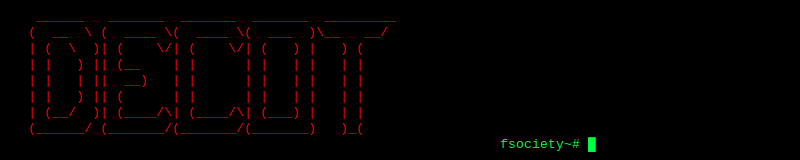

<!-- fsociety was here -->

<p align="center">
  
</p>

<p align="center">
  
</p>

---

<div align="center">

```
        }------{+} Session Established {+}------{
        }--------{+}   USER: sronters   {+}------{
        }------{+} Encryption: ACTIVE   {+}------{
```

</div>

<div align="center">

```bash
fsociety~# whoami
> Baktiyar Ablaikhan  |  Astana, KZ  |  Grade 9 @ NIS
> "The world itself is just one big machine. You know? Machines
>  never have any extra parts. They have the exact amount they
>  need." — Elliot Alderson
```

</div>

---

<div align="center">

```
    {1}--Satellite Intelligence
    {2}--Edge AI Systems
    {3}--Neural Networks
    {4}--Signal Processing
    {5}--Anomaly Detection
    {6}--LLM Research
    {7}--Embedded Systems
    {8}--Post Exploitation of Reality
    {0}--INSTALL & UPDATE the world
    {99}-Exit
```

</div>

<div align="center"><code>fsociety~# █</code></div>

---

<div align="center">

```zsh
fsociety~# cat /etc/motd

  "I wanted to save the world."
  "So did I."

  — Mr. Robot, Season 1
```

</div>

---

### `fsociety~# cat ~/.skill_tree`

<div align="center">


</div>

---

### `fsociety~# ps aux | grep "sronters" --stats`

<div align="center">
  
  
</div>

---

### `fsociety~# ./snake --eat-contributions`

<div align="center">
  <picture>
    <source media="(prefers-color-scheme: dark)" srcset="https://raw.githubusercontent.com/sronters/sronters/output/github-contribution-grid-snake-dark.svg" />
    <source media="(prefers-color-scheme: light)" srcset="https://raw.githubusercontent.com/sronters/sronters/output/github-contribution-grid-snake.svg" />
    
  </picture>
</div>

---

### `fsociety~# ping --social`

<div align="center">

```
PING github.com/sronters                 ... [REACHABLE]
PING linkedin.com/in/baktiyar-ablaikhan- ... [REACHABLE]
PING kaggle.com/bakhtiyar2222            ... [REACHABLE]
PING neweraprojecta@gmail.com            ... [REACHABLE :: ENCRYPTED]
```

</div>

---

<div align="center">
  <sub><code>// "Give a man a gun and he can rob a bank. Give a man a bank and he can rob the world." — Mr. Robot</code></sub>
</div>

<!-- }------{+} FSOCIETY WAS HERE {+}------{ -->
